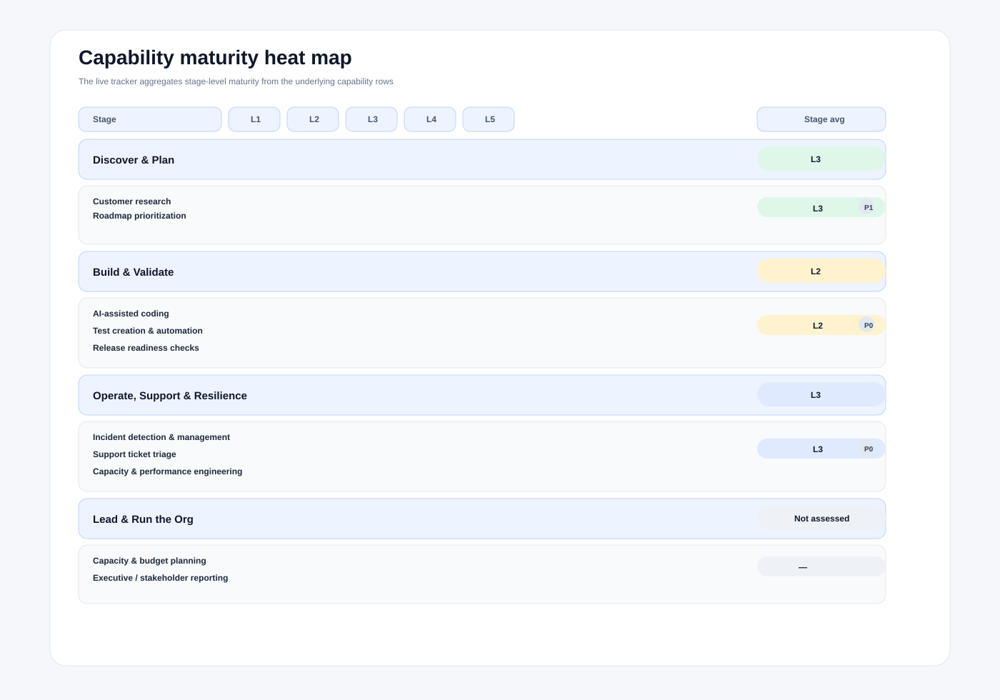
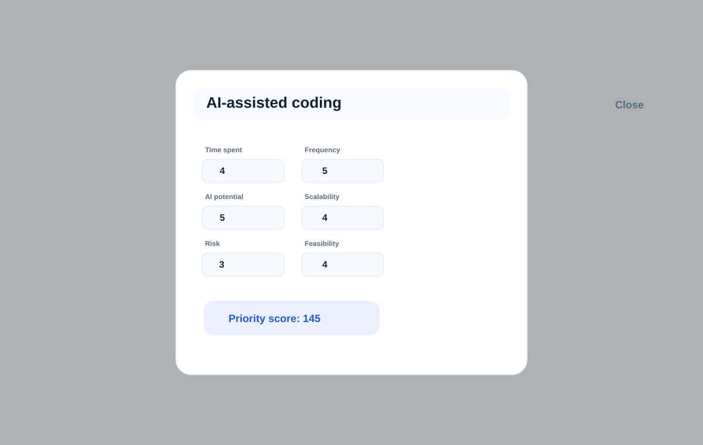
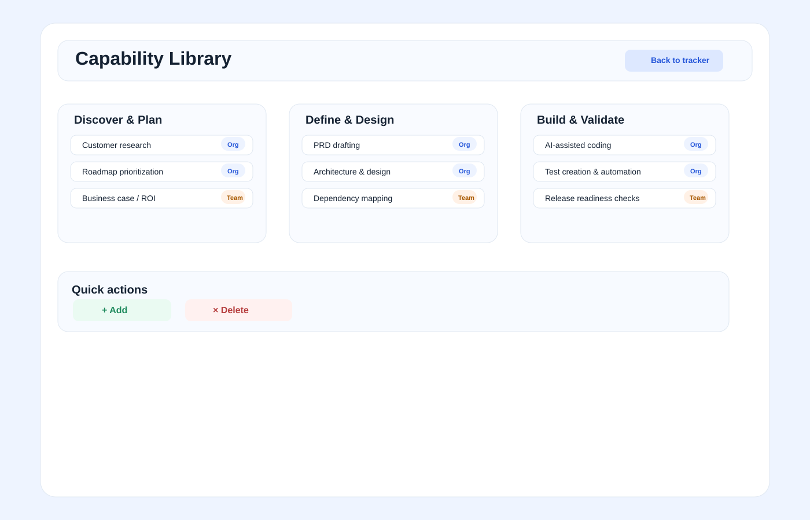

# Dunder Mifflin AI-PDLC Case Study

This example shows how a leadership team can use the tracker to move from scattered experimentation to a clear, shared investment strategy. The goal is not to rank people or teams in isolation. The goal is to evaluate the capabilities needed to deliver work reliably, improve experience, and create measurable value across the organization.

## Executive summary

Michael Scott is the overall org leader. He has four leaders reporting into him, and each one leads a smaller business unit or operating org with multiple teams and functions underneath them. The tracker should be viewable at every level of this hierarchy: Scott sees the root roll-up, while Pam, Jim, Dwight, and Angela each see their own org view before those numbers are aggregated upward.

- Pam Beesly — Org Leader, X
- Jim Halpert — Org Leader, Y
- Dwight Schrute — Org Leader, Z
- Angela Martin — Org Leader, W

Each of these leaders owns a broad operating area, not just a single specialist lane. Their organizations include the people, processes, and functions needed to run the work end-to-end across the PDLC. Michael is not trying to optimize one function in isolation. He is aggregating capability maturity across all the operating orgs to decide how to invest, standardize, and scale across the whole business.

## The operating model behind the example

The tracker distinguishes three patterns of capability placement:

- Central: a capability is shared across the organization and should be standardized once
- Hybrid: a local team executes it, but the org needs shared standards, controls, or tooling
- Team-specific: the capability is tightly bound to a team, domain, or customer context

This matters because AI transformation often fails when leaders treat every capability as either fully centralized or fully local. In reality, many high-impact capabilities sit in the middle: highly valuable, widely relevant, but still needing team-level nuance.

It is also important to distinguish between capabilities that have not yet been reviewed and capabilities that were reviewed and intentionally left as not started. In the tracker, the default state is "Not assessed" until a leader evaluates a capability. "Not started" is only used after the leader has reviewed it and decided it is relevant but has not begun execution yet.

## Team-level view

Below is what each leader sees in their local view before the aggregate org view is built.

### Pam Beesly — Org Leader, X

| Stage | Capability | Scope | Current | Target | Status | Priority |
| --- | --- | --- | --- | --- | --- | --- |
| Release & Customer Adoption | Customer onboarding & configuration | Team-specific | L2 | L4 | Piloting | P1 |
| Operate, Support & Resilience | Support ticket triage | Central | L2 | L4 | Piloting | P0 |
| Learn & Optimize | Customer feedback synthesis | Hybrid | L1 | L3 | Not started | P0 |

Pam leads the customer operations business unit. That org includes service, onboarding, customer support, and experience-related teams. Her job is not to optimize one narrow function; it is to run the full customer-facing operating model and make sure work moves smoothly across the customer journey.

### Jim Halpert — Org Leader, Y

| Stage | Capability | Scope | Current | Target | Status | Priority |
| --- | --- | --- | --- | --- | --- | --- |
| Build & Validate | AI-assisted coding | Team-specific | L2 | L4 | Piloting | P0 |
| Define & Design | Requirements & PRD drafting | Central | L2 | L3 | Not started | P1 |
| Build & Validate | Test creation & automation | Hybrid | L2 | L4 | Piloting | P0 |

Jim leads the product and delivery org, which includes product, engineering, QA, release, and delivery teams. He is accountable for the full value stream, not just the engineering function. His focus is on capability maturity across planning, delivery, and execution.

### Dwight Schrute — Org Leader, Z

| Stage | Capability | Scope | Current | Target | Status | Priority |
| --- | --- | --- | --- | --- | --- | --- |
| Discover & Plan | Warehouse workflow optimization | Team-specific | L1 | L3 | Not started | P0 |
| Operate, Support & Resilience | Incident detection & management | Central | L2 | L4 | Piloting | P0 |
| Operate, Support & Resilience | SLA / SLO tracking | Hybrid | L2 | L3 | Piloting | P1 |

Dwight leads the service operations business unit, covering service continuity, field execution, escalation paths, and operational recovery. His org must make service work reliable across many local teams while still allowing the business to adapt to context-specific operational realities.

### Angela Martin — Org Leader, W

| Stage | Capability | Scope | Current | Target | Status | Priority |
| --- | --- | --- | --- | --- | --- | --- |
| Build & Validate | Security reviews | Central | L2 | L4 | Piloting | P0 |
| Operate, Support & Resilience | Root cause analysis / post-incident review | Central | L2 | L4 | Piloting | P0 |
| Lead & Run the Org | Vendor risk management | Team-specific | L1 | L3 | Not started | P1 |

Angela leads the risk, controls, and compliance org. That includes governance, policy, audit, vendor oversight, and risk management functions. Her leadership scope spans controls and operational safeguards across the enterprise, not just a single technical specialty.

## Sample org heatmap from the case study

The tracker should default to a neutral heatmap state for every stage until the leader has reviewed a capability. In this example, the heatmap reflects a mix of assessed and unassessed areas. The gray rows indicate that a capability has not yet been reviewed; the colored cells indicate that the org has already assessed the capability and assigned a maturity level. Critically, each stage is paired with the actual capability set mapped to it, and the most urgent capability gaps within that stage are surfaced first so the leader can immediately tell what work sits under each stage and which issues deserve attention now. The stage itself also carries a single aggregated maturity highlight generated from the average of its assessed capability rows, while the capability rows beneath it show the underlying detail that created that stage score.

| Stage | Mapped capabilities | Heatmap status | Interpretation |
| --- | --- | --- | --- |
| Discover & Plan | Customer research, roadmap prioritization | Gray / partially assessed | Some planning capabilities were reviewed, but the rest remains unassessed |
| Define & Design | PRD drafting, architecture reviews, dependency mapping | Gray / partially assessed | Key design and PRD work is known, but not all areas have been evaluated |
| Build & Validate | AI-assisted coding, test creation & automation, release readiness checks | Yellow / active assessment | AI-assisted coding and test automation are already in scope |
| Release & Customer Adoption | Customer onboarding, release planning, training & enablement | Gray / limited signal | Customer onboarding is active, but a broader release view remains under review |
| Operate, Support & Resilience | Incident detection, support ticket triage, SLA / SLO tracking | Yellow / active assessment | Incident detection and operational service capabilities are already being evaluated |
| Learn & Optimize | Product analytics, customer feedback synthesis | Gray / emerging view | Some analytics work is known, but the full learning loop is still incomplete |
| Lead & Run the Org | Capacity planning, stakeholder reporting, vendor management | Gray / default baseline | Leadership and governance mechanics are not yet fully reviewed |

This is exactly how the heatmap should behave in the product: the default state is not “failed or weak,” it is simply “not assessed yet.” The heatmap updates as the leader scores the relevant capabilities and moves from a neutral baseline into an active operating picture.

## Org-level roll-up

Michael sees the aggregate view, not a fragmented collection of team responses. The tracker consolidates the assessment into a clearer operating picture. When the same capability is assessed by multiple leaders at different levels of the org, the root view averages or consolidates those values rather than treating them as separate, conflicting inputs.

| Stage | Capability | Aggregate view | Priority | Recommended investment |
| --- | --- | --- | --- | --- |
| Operate, Support & Resilience | Support ticket triage | Central | P0 | Build centrally |
| Operate, Support & Resilience | Incident detection & management | Central | P0 | Build centrally |
| Build & Validate | Security reviews | Central | P0 | Centralized governance investment |
| Build & Validate | AI-assisted coding | Team-specific | P0 | Support team-level investment |
| Release & Customer Adoption | Customer onboarding & configuration | Team-specific | P1 | Local team investment |
| Operate, Support & Resilience | SLA / SLO tracking | Hybrid | P1 | Shared framework with local execution |

This is the decision pattern the tracker is meant to unlock: it helps leaders separate capabilities that should be standardized once, governed centrally, and deployed broadly from those that should remain team-owned and customized to local context.

## Visual snapshots of the tracker

The examples below show how the tracker looks in practice at the org level, stage level, and capability-editing level. These are intentionally kept generic in the product itself, while the case-study narrative can still use Scott’s org example to explain the operating model.

### 1. Executive dashboard view

This is the first view a leader sees. It combines the org-wide summary cards with the PDLC heatmap and scope filters, giving a single operating view across all stages before anyone drills into a particular capability.

### 2. Capability maturity heat map

This view shows the capability maturity heat map, not a stage-only scorecard. Each stage is grouped as a section, with a single highlighted aggregate maturity signal at the stage level and the underlying capability rows underneath it. That makes the executive summary visible without hiding the detailed operating evidence: leaders can see the stage average and the specific capabilities that created it, while unassessed capabilities stay gray and without a priority badge.

### 3. Priority input editor

The priority model is transparent: leaders tune the real inputs (time spent, frequency, AI potential, scalability, risk, feasibility) and the score updates immediately. This creates trust because the decision is tied to evidence, not a subjective guess.

### 4. Editable capability library

The capability library keeps the model structured by stage while still remaining editable. Leaders can add, rename, or remove capabilities at the org or team level without breaking the underlying maturity model.

## Why this matters

The tracker helps answer a question that many organizations struggle with during AI transformation:

Where do we invest once, and where do we allow local experimentation?

Without this clarity, leaders often do one of two things:

- centralize everything and slow down local teams
- decentralize everything and create inconsistency, duplicated effort, and risk

The tracker creates a more practical operating model:

- centralized capabilities create leverage at scale
- team-specific capabilities create speed and fit for real work
- hybrid capabilities need governance without over-centralization

## Visual org summary

| Investment type | Capabilities | Decision |
| --- | --- | --- |
| Central | Support ticket triage, Incident detection & management, Security reviews | Build once and scale across the org |
| Hybrid | Customer feedback synthesis, Test creation & automation, SLA / SLO tracking | Shared standards with local execution |
| Team-specific | AI-assisted coding, Customer onboarding & configuration, Warehouse workflow optimization | Local team investment |

This is the view Michael sees before deep-diving into any one domain. It gives him a quick read on where the org has the highest leverage, where local experimentation matters, and where shared controls are non-negotiable.

## Michael's final decision

| Recommendation | Why |
| --- | --- |
| Build support ticket triage centrally | It reduces service friction across multiple teams and improves experience consistency |
| Build incident detection centrally | It strengthens operational resilience and speeds recovery across the org |
| Keep security reviews centralized | It is a governance control that should not vary by team |
| Support AI-assisted coding at team level | It creates engineering leverage but depends on team context and workflow |
| Invest in customer onboarding locally | It is tightly tied to customer journey and team operating model |
| Use a hybrid approach for SLA / SLO tracking | It needs shared definitions but local monitoring and execution |

## What this demonstrates

This example shows the tracker at its best:

- it surfaces the organization’s real operational priorities
- it captures both shared and local capability maturity
- it helps leaders decide where to invest for leverage instead of reacting to noise
- it turns fragmented opinions into a shared, structured investment story

The value is not simply “a maturity score.” The value is a clearer path to transformation: identify the core capabilities, decide the right operating model, and focus investment where it creates the most meaningful business impact.
